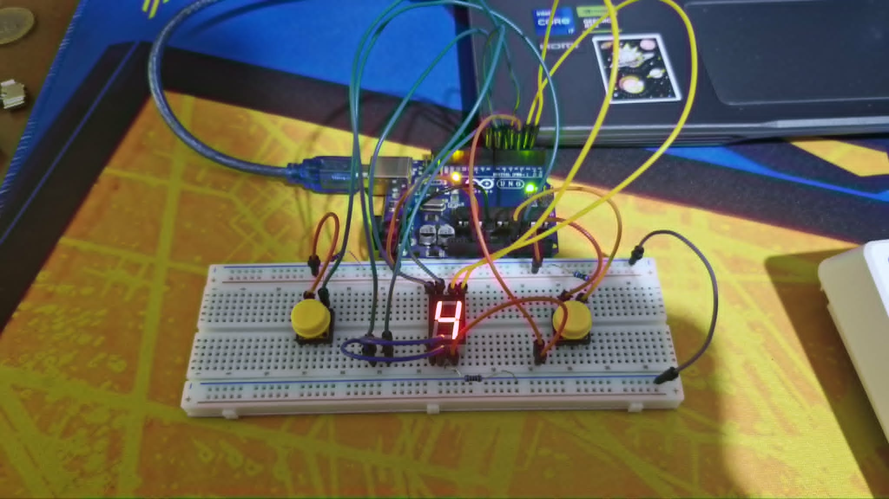

# Arduino 7-Segment Counter

This is a simple Arduino project using a 7-segment display with **two buttons**:
- **Button 1:** Increments the counter
- **Button 2:** Decrements the counter

---

## Demo

### Photo of the setup

### Demo Video
[Watch the demo video](Media/Demo.gif)

---

## Features
- Counts up and down using two buttons
- Displays the count on a 7-segment display

---

## Hardware Used
- Arduino Uno
- 7-segment display
- 2 push buttons
- Jumper wires
- Breadboard
- Resistors

---

## Wiring
- Connect the 7-segment display to digital pins of the Arduino
- Connect the buttons to analog/digital pins and GND
- Ensure proper pull-down/pull-up resistors

---

## Code
- Upload the `counter_7_segment.ino` file to your Arduino using the Arduino IDE
- Modify pin numbers in the code if your wiring is different

---

## License
This project is open source. Feel free to use and modify it!
